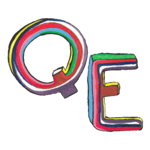

<a id="readme-top"></a>


<!-- PROJECT SHIELDS -->
[![Contributors][contributors-shield]][contributors-url]
[![Forks][forks-shield]][forks-url]
[![Stargazers][stars-shield]][stars-url]
[![Issues][issues-shield]][issues-url]
[![Apache License][license-shield]][license-url]
[![LinkedIn][linkedin-shield]][linkedin-url]


<!-- PROJECT LOGO -->
<br />
<div align="center">
  <a href="https://github.com/willdelorm/queer-eugene-2024">
    
  </a>

<h3 align="center">Queer Eugene</h3>

  <p align="center">
    Major redesign of non-profit website with admin dashboard to manage data throughout site.
    <br />
    <a href="https://github.com/willdelorm/queer-eugene-2024"><strong>Explore the docs »</strong></a>
    <br />
    <br />
    <!-- <a href="https://github.com/willdelorm/queer-eugene-2024">View Demo</a>
    &middot; -->
    <a href="https://github.com/willdelorm/queer-eugene-2024/issues/new?labels=bug&template=bug-report---.md">Report Bug</a>
    &middot;
    <a href="https://github.com/willdelorm/queer-eugene-2024/issues/new?labels=enhancement&template=feature-request---.md">Request Feature</a>
  </p>
</div>


<!-- TABLE OF CONTENTS -->
<details>
  <summary>Table of Contents</summary>
  <ol>
    <li>
      <a href="#about-the-project">About The Project</a>
      <ul>
        <li><a href="#built-with">Built With</a></li>
      </ul>
    </li>
    <li>
      <a href="#getting-started">Getting Started</a>
      <ul>
        <li><a href="#prerequisites">Prerequisites</a></li>
        <li><a href="#installation">Installation</a></li>
      </ul>
    </li>
    <li><a href="#usage">Usage</a></li>
    <li><a href="#roadmap">Roadmap</a></li>
    <li><a href="#contributing">Contributing</a></li>
    <li><a href="#license">License</a></li>
    <li><a href="#contact">Contact</a></li>
    <li><a href="#acknowledgments">Acknowledgments</a></li>
  </ol>
</details>


<!-- ABOUT THE PROJECT -->
## About The Project

[![Product Name Screen Shot][product-screenshot]](https://example.com)
<p>Since its inception in 2021, Queer Eugene has grown rapidly. The previous version of their website was written in plain HTML/CSS and quickly outgrew its original scope. I was brought on to co-build a more mature site that could support the pace of growth in the organization.</p>
<p>The primary purpose of the redesign was to allow Queer Eugene's administration to better manage an ever-expanding list of queer resources. This requirement lead to setting up a database to store all of their data and an admin dashboard for organization staff to interface with the database.</p>

<p align="right">(<a href="#readme-top">back to top</a>)</p>


### Built With

* [![Next][Next.js]][Next-url]
* [![React][React.js]][React-url]
* [![TailwindCSS][Tailwindcss.com]][Tailwind-url]

<p align="right">(<a href="#readme-top">back to top</a>)</p>


<!-- GETTING STARTED -->
## Getting Started

To get a local copy up and running follow these simple steps:

### Prerequisites

  ```sh
  npm install npm@latest -g
  ```

### Installation

1. Clone the repo
   ```sh
   git clone https://github.com/willdelorm/queer-eugene-2024.git
   ```
3. Install NPM packages
   ```sh
   npm install
   ```
4. Run the dev environment
   ```sh
   npm run dev
   ```
5. Open `http://localhost:3000` in your browser to explore the app

<p align="right">(<a href="#readme-top">back to top</a>)</p>


<!-- USAGE EXAMPLES -->
## Usage

Use this space to show useful examples of how a project can be used. Additional screenshots, code examples and demos work well in this space. You may also link to more resources.

_For more examples, please refer to the [Documentation](https://example.com)_

<p align="right">(<a href="#readme-top">back to top</a>)</p>


<!-- ROADMAP -->
## Roadmap

- [ ] Feature 1
- [ ] Feature 2
- [ ] Feature 3
    - [ ] Nested Feature

See the [open issues](https://github.com/willdelorm/queer-eugene-2024/issues) for a full list of proposed features (and known issues).

<p align="right">(<a href="#readme-top">back to top</a>)</p>


<!-- CONTRIBUTING -->
## Contributing

Contributions are what make the open source community such an amazing place to learn, inspire, and create. Any contributions you make are **greatly appreciated**.

If you have a suggestion that would make this better, please fork the repo and create a pull request. You can also simply open an issue with the tag "enhancement".
Don't forget to give the project a star! Thanks again!

1. Fork the Project
2. Create your Feature Branch (`git checkout -b feature/AmazingFeature`)
3. Commit your Changes (`git commit -m 'Add some AmazingFeature'`)
4. Push to the Branch (`git push origin feature/AmazingFeature`)
5. Open a Pull Request

<p align="right">(<a href="#readme-top">back to top</a>)</p>

### Top contributors:

<a href="https://github.com/willdelorm/queer-eugene-2024/graphs/contributors">
  
</a>


<!-- LICENSE -->
## License

Distributed under the Apache License. See `LICENSE.txt` for more information.

<p align="right">(<a href="#readme-top">back to top</a>)</p>


<!-- CONTACT -->
## Contact

Your Name - will@willdelorm.com

Project Link: [https://github.com/willdelorm/queer-eugene-2024](https://github.com/willdelorm/queer-eugene-2024)

<p align="right">(<a href="#readme-top">back to top</a>)</p>


<!-- ACKNOWLEDGMENTS -->
## Acknowledgments

* []()
* []()
* []()

<p align="right">(<a href="#readme-top">back to top</a>)</p>


<!-- MARKDOWN LINKS & IMAGES -->
<!-- https://www.markdownguide.org/basic-syntax/#reference-style-links -->
[contributors-shield]: https://img.shields.io/github/contributors/willdelorm/queer-eugene-2024.svg?style=for-the-badge
[contributors-url]: https://github.com/willdelorm/queer-eugene-2024/graphs/contributors
[forks-shield]: https://img.shields.io/github/forks/willdelorm/queer-eugene-2024.svg?style=for-the-badge
[forks-url]: https://github.com/willdelorm/queer-eugene-2024/network/members
[stars-shield]: https://img.shields.io/github/stars/willdelorm/queer-eugene-2024.svg?style=for-the-badge
[stars-url]: https://github.com/willdelorm/queer-eugene-2024/stargazers
[issues-shield]: https://img.shields.io/github/issues/willdelorm/queer-eugene-2024.svg?style=for-the-badge
[issues-url]: https://github.com/willdelorm/queer-eugene-2024/issues
[license-shield]: https://img.shields.io/github/license/willdelorm/queer-eugene-2024.svg?style=for-the-badge
[license-url]: https://github.com/willdelorm/queer-eugene-2024/blob/master/LICENSE.txt
[linkedin-shield]: https://img.shields.io/badge/-LinkedIn-black.svg?style=for-the-badge&logo=linkedin&colorB=555
[linkedin-url]: https://linkedin.com/in/willdelorm
[product-screenshot]: public/images/ss-homepage.png
[Next.js]: https://img.shields.io/badge/next.js-000000?style=for-the-badge&logo=nextdotjs&logoColor=white
[Next-url]: https://nextjs.org/
[React.js]: https://img.shields.io/badge/React-20232A?style=for-the-badge&logo=react&logoColor=61DAFB
[React-url]: https://reactjs.org/
[Tailwindcss.com]: https://img.shields.io/badge/tailwind-00BCFF?style=for-the-badge&logo=tailwindcss&logoColor=white
[Tailwind-url]: https://tailwindcss.com